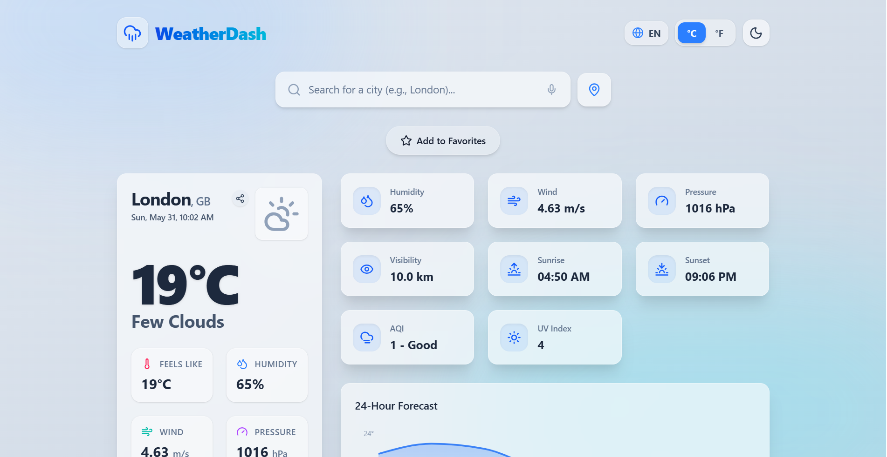

# 🌤️ Premium Weather Dashboard

[](https://weather-dashboard-h4v0wtmxg-adivaakar2006-cmyks-projects.vercel.app/)

A beautiful, modern, and highly responsive Progressive Web App (PWA) that provides real-time weather tracking, 5-day forecasts, and an interactive charting experience. Built with React and Tailwind CSS v4.



## 🚀 Features

- **Real-Time Data:** Instant, accurate weather data powered by the OpenWeatherMap API.
- **Dynamic UI:** The application's background gradients automatically change based on the current weather conditions (e.g., sunny, rainy, cloudy).
- **Progressive Web App (PWA):** Fully installable on Desktop, iOS, and Android devices for an app-like native experience.
- **Geolocation:** Automatically detects your current location with a single click.
- **Favorites & History:** Save your favorite cities and instantly access your 5 most recent searches.
- **Interactive Charts:** Beautifully visualized hourly and weekly forecast trends using Recharts.
- **Customization:** 
  - Dark / Light Mode Toggle
  - Celsius / Fahrenheit Toggle
  - English / Hindi Translation Toggle
- **Glassmorphism Design:** Premium UI featuring blurred glass panels and subtle micro-animations.

## 🛠️ Tech Stack

- **Frontend:** React 19, Vite
- **Styling:** Tailwind CSS v4, Lucide-React Icons
- **Data Visualization:** Recharts
- **State Management:** React Context API, Custom Hooks (`useLocalStorage`, `useGeolocation`, `useWeather`)
- **API Networking:** Axios (OpenWeather API)
- **Deployment:** Vercel

## 💻 Running Locally

1. **Clone the repository:**
   ```bash
   git clone https://github.com/your-username/weather-dashboard.git
   cd weather-dashboard
   ```

2. **Install dependencies:**
   ```bash
   npm install
   ```

3. **Environment Variables:**
   Create a `.env` file in the root directory and add your OpenWeather API Key:
   ```env
   VITE_OPENWEATHER_API_KEY=your_api_key_here
   ```

4. **Start the development server:**
   ```bash
   npm run dev
   ```

## 🌐 Deployment

This project is configured for instant deployment on **Vercel**. 
Simply import the repository into Vercel, add your `VITE_OPENWEATHER_API_KEY` to the Environment Variables settings, and click Deploy. Vercel will automatically detect the Vite build environment and compile the PWA.

---
*Designed & Built for a seamless meteorological experience.*
